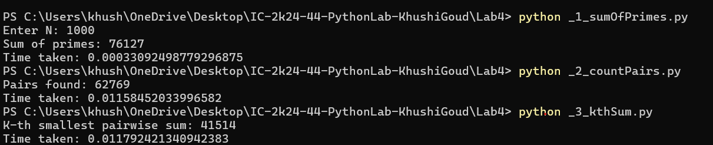

# Python Optimization Assignment

This repository contains solutions for algorithm optimization. It demonstrates how choosing better algorithms and data structures can reduce time and space complexity compared with naive approaches.

---

# Section A: Before You Start

## 1. What do you think makes one piece of code faster than another that produces the same output?

Reducing the total number of operations required makes code faster. Choosing an efficient algorithm with lower time complexity and using suitable data structures can significantly improve performance.

For example, using a Hash Map for average O(1) lookup can be much faster than repeatedly performing an O(N) linear search.

## 2. Name any Python function or technique you already know that helps avoid repeating work.

Some techniques that help avoid repeating work are:

- Memoization
- Dynamic Programming
- Hash Maps / Dictionaries
- Sets

---

# Section B: Problem 1 — Sum of All Primes Below N

## Step 1: Naive Version

The naive approach checks every number from `2` to `N - 1` and tests all possible divisors from `2` to `x - 1`.

### Naive Code

```python
import time

def sum_primes_naive(N):
    total = 0

    for x in range(2, N):
        is_prime = True

        for d in range(2, x):
            if x % d == 0:
                is_prime = False
                break

        if is_prime:
            total += x

    return total


N = int(input("Enter N: "))

start = time.time()

result = sum_primes_naive(N)

print("Sum of primes:", result)
print("Time taken:", time.time() - start)
Time Complexity
O(N²)
Space Complexity
O(1)
The naive approach performs a large number of divisor checks. As N increases, the number of operations grows quadratically.
Correctness Test Cases
N = 10   → 17
N = 2    → 0
N = 3    → 2
N = 20   → 77
N = 100  → 1060
Step 2: Hint 1 — Smaller Bound
If x has a divisor greater than √x, it must also have a corresponding divisor smaller than √x.
Therefore, checking divisors only up to:
⌊√x⌋
is mathematically sufficient.
Improved Code
import time

def sum_primes_sqrt(N):
    total = 0

    for x in range(2, N):
        is_prime = True

        for d in range(2, int(x ** 0.5) + 1):
            if x % d == 0:
                is_prime = False
                break

        if is_prime:
            total += x

    return total


N = int(input("Enter N: "))

start = time.time()

result = sum_primes_sqrt(N)

print("Sum of primes:", result)
print("Time taken:", time.time() - start)

Time Complexity
Approximately O(N√N)
Space Complexity
O(1)
Improvement
The number of divisor checks is reduced because each number is checked only up to its square root instead of checking all numbers up to x - 1.
Step 3: Hint 2 — Fully Optimized Sieve of Eratosthenes
Instead of checking whether every number is prime independently, the Sieve of Eratosthenes creates a boolean array and marks multiples of prime numbers as composite.

Optimized Code
import time

def sum_primes_sieve(N):

    if N <= 2:
        return 0

    is_prime = [True] * N

    is_prime[0] = False
    is_prime[1] = False

    p = 2

    while p * p < N:

        if is_prime[p]:

            for i in range(p * p, N, p):
                is_prime[i] = False

        p += 1

    total = 0

    for i in range(2, N):
        if is_prime[i]:
            total += i

    return total


N = int(input("Enter N: "))

start = time.time()

result = sum_primes_sieve(N)

print("Sum of primes:", result)
print("Time taken:", time.time() - start)

Time Complexity
O(N log log N)
Space Complexity
O(N)
Why is this optimized?
The naive approach tests each number independently.
The Sieve of Eratosthenes marks composite numbers in bulk, avoiding repeated primality checks.

Questions 3–6 Analysis
Question 3: What did you observe?
The naive approach grows quadratically, making it impractical for very large values of N.
Question 4: How much faster was the smaller-bound version?
Checking divisors only up to √x significantly reduces the number of operations compared with the naive approach. However, it is still slower than the Sieve for large values of N.
Question 5: Compare the three approaches.
Naive:
O(N²)

Smaller Bound:
Approximately O(N√N)

Sieve:
O(N log log N)
Question 6: Which change gave the biggest jump in speed?
The biggest improvement came from using the Sieve of Eratosthenes because it fundamentally changes the approach from testing each number separately to marking composite numbers collectively.


Section C: Problem 2 — Count Pairs With a Given Sum
Step 1: Naive Version
The naive approach uses two nested loops to check every possible pair.
The number of pairs is:
N(N - 1) / 2

Naive Code
def count_pairs_naive(arr, target):

    count = 0
    n = len(arr)

    for i in range(n):

        for j in range(i + 1, n):

            if arr[i] + arr[j] == target:
                count += 1

    return count

Time Complexity
O(N²)
Space Complexity
O(1)
Step 2: Hash Map Optimization
For every element x, the required complement is:
target - x
A dictionary stores the frequencies of previously seen values.
This allows average O(1) lookup instead of searching through the array repeatedly.
Optimized Code
def count_pairs(arr, target):

    freq = {}
    count = 0

    for x in arr:

        complement = target - x

        if complement in freq:
            count += freq[complement]

        if x in freq:
            freq[x] += 1
        else:
            freq[x] = 1

    return count


arr = [2, 7, 11, 15]
target = 9

result = count_pairs(arr, target)

print("Array:", arr)
print("Target:", target)
print("Number of pairs:", result)

Output
Array: [2, 7, 11, 15]
Target: 9
Number of pairs: 1
Time Complexity
O(N) average
Space Complexity
O(N)
Complexity Comparison
Approach	Time Complexity	Space Complexity
Naive	O(N²)	O(1)
Hash Map	O(N) average	O(N)


Questions 7–9 Analysis
Question 7: What happens when N increases?
When N increases by 10×, the number of possible pairs increases approximately by 100×.
This matches the quadratic complexity:
O(N²)

Question 8: Why is the optimized version faster?
The optimized version removes the inner loop.
Instead of searching for the required complement repeatedly, a dictionary provides average O(1) lookup.

Question 9: What category of change made this faster?
The optimization uses both:
1. A smarter algorithm
2. A better data structure
The dictionary replaces repeated searching with fast average-case lookup.
Therefore:
O(N²) → O(N) average


Section D: Problem 3 — K-th Smallest Pairwise Sum
Step 1: Naive Version
The naive approach:
1. Generates every pairwise sum.
2. Stores all sums.
3. Sorts the sums.
4. Returns the K-th smallest sum.
The number of pairs is:
N(N - 1) / 2
For N = 5000:
12,497,500 pairs
Naive Code
def kth_smallest_naive(arr, K):

    sums = []
    n = len(arr)

    for i in range(n):

        for j in range(i + 1, n):

            sums.append(arr[i] + arr[j])

    sums.sort()

    return sums[K - 1]

Time Complexity
O(N² log N)
Space Complexity
O(N²)
The main problem is that all pairwise sums have to be generated and stored before finding the answer.
Steps 2–4: Optimized Solution
Binary Search + Two Pointers
Instead of generating every pairwise sum, we search over possible answer values.
For a particular value mid, we count how many pairs have a sum less than or equal to mid.
Two pointers allow this counting to be performed in O(N) time after sorting.
Optimized Code
def count_pairs_le(arr, value):

    count = 0
    left = 0
    right = len(arr) - 1

    while left < right:

        if arr[left] + arr[right] <= value:

            count += right - left
            left += 1

        else:
            right -= 1

    return count


def kth_smallest_optimized(arr, K):

    arr.sort()

    low = arr[0] + arr[1]
    high = arr[-1] + arr[-2]

    while low < high:

        mid = (low + high) // 2

        if count_pairs_le(arr, mid) >= K:
            high = mid

        else:
            low = mid + 1

    return low


arr = [1, 3, 5, 7]
K = 3

result = kth_smallest_optimized(arr, K)

print("Array:", arr)
print("K:", K)
print("K-th smallest pairwise sum:", result)

Output
Array: [1, 3, 5, 7]
K: 3
K-th smallest pairwise sum: 8
Time Complexity
Sorting takes:
O(N log N)
Each two-pointer count takes:
O(N)
Binary search over the answer range takes:
O(log R)
Therefore, the overall complexity is:
O(N log N + N log R)
where R is the range of possible pair-sum values.
Additional Space Complexity
O(1)
The algorithm does not explicitly create or store the O(N²) pairwise sums.

Question 10 Analysis
The biggest improvement comes from avoiding explicit generation of all pairwise sums.
The optimized approach searches directly over the possible answer values and uses two pointers to count valid pairs.
Therefore:
Naive:
O(N² log N) time
O(N²) space

Optimized:
O(N log N + N log R) time
O(1) additional space


Section E: Reflection
1. What is the common lesson across all three problems?
The common lesson is that choosing an efficient algorithm and suitable data structure can greatly reduce unnecessary work.
2. Would you change your answer from Section A?
Yes.
Avoiding repeated work is important, but selecting the correct algorithm and data structure has an even greater effect on scalability.
3. Which technique are you most likely to use again?
Hash-based lookup using dictionaries or sets is a useful technique because it provides fast average-case lookup and can replace many unnecessary nested searches.


## Terminal Output

